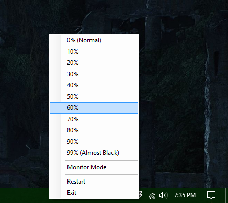

DimThing
=========

Allows you to dim your desktop if its a bit to bright.

##Features
- Multiple monitors
- Command line support
- Smooth transitions!
- Mode to exclude or include primary monitor
- Keyboard Shortcuts
  - Increase Dimness
    - Alt + Add
    - Alt + Plus
  - Decrease Dimness
    - Alt + Subtract
    - Alt + Minus
  - Mode Toggle
    - Alt + |

